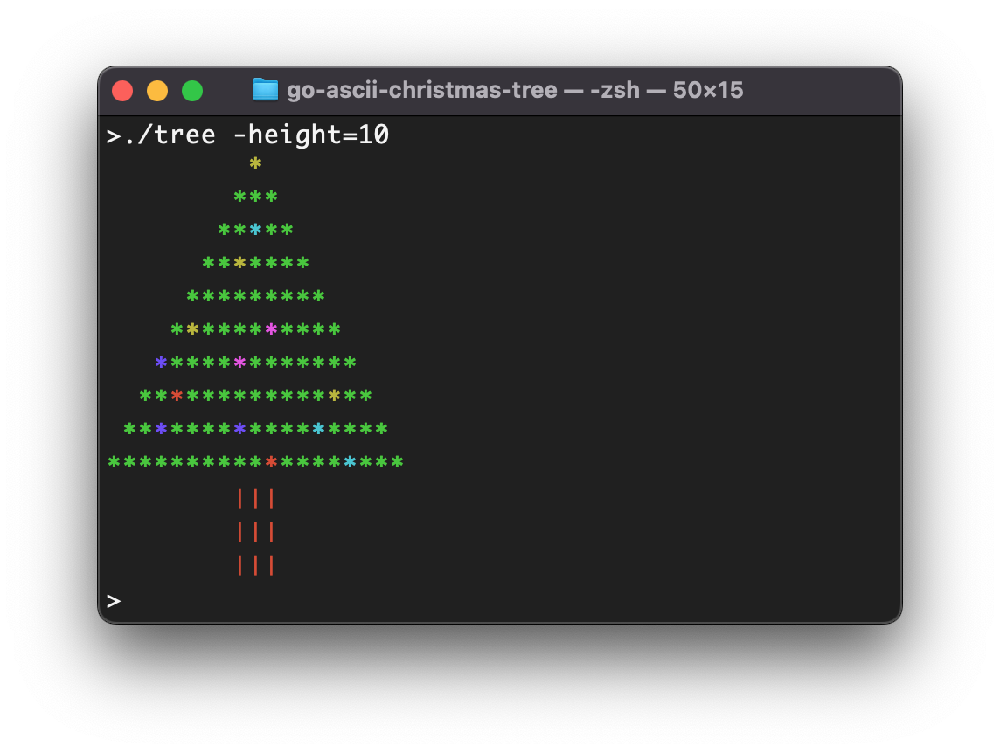

# 🎄 ASCII Christmas tree

## Description

I heard about a fun little coding exercise to draw an ASCII Christmas tree given a hight of `n`. It's interesting because it gets you thinking about how long each line should be, how many spaces are required to pad each line and how big the base of the tree should be.

I wrote an version using Go and added some extra colour in to make it more Christmassy. ☃️



## Running the code

### Prerequisites

Install Go using brew

```shell
brew install go
```

### Instructions

Clone the repositorty 

```shell
git clone git@github.com:farmerajf/go-ascii-christmas-tree.git
```

Change directory to the project

```shell
cd go-ascii-christmas-tree
```

Build the code

```shell
go build tree.go
```

Run the code 

```shell
./tree
```

### Options

```textile
Usage of ./tree:
  -flash
    	Turn on flashing lights
  -height int
    	The height of the tree (default 10)
  -lights int
    	The spacing for the lights (default 5)

```

To get help use

```shell
./tree -help
```


